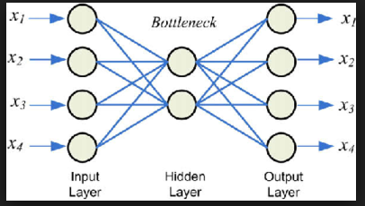
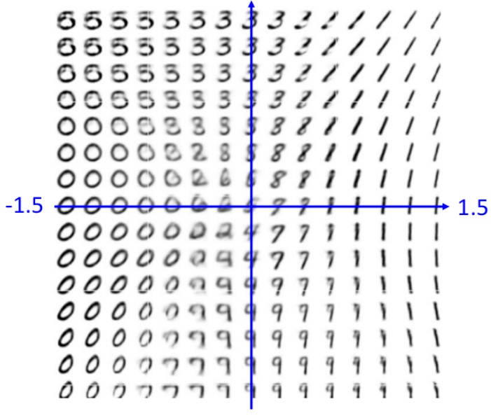

## Autoencoders
So far, we have described the application of neural networks to supervised learning, in which we have labeled training examples.
Now suppose we have only a set of unlabeled training examples {x(1),x(2),x(3),…}, where x(i)∈Rn. 
An autoencoder neural network is an unsupervised learning algorithm that applies backpropagation, 
setting the target values to be equal to the inputs. I.e.,
it uses y(i)=x(i).

    

## Concept
The autoencoder tries to learn a function hW,b(x)≈x. In other words, it is trying to learn an approximation to the identity function, so as to output x^ that is similar to x. The identity function seems a particularly trivial function to be trying to learn; but by placing constraints on the network, such as by limiting the number of hidden units, we can discover interesting structure about the data. As a concrete example, suppose the inputs x are the pixel intensity values from a 10×10 image (100 pixels) so n=100, and there are s2=50 hidden units in layer L2.

Note that we also have y∈R100. Since there are only 50 hidden units, the network is forced to learn a ”compressed” representation of the input. I.e., given only the vector of hidden unit activations a(2)∈R50, it must try to ”‘reconstruct”’ the 100-pixel input x. If the input were completely random—say, each xi comes from an IID Gaussian independent of the other features—then this compression task would be very difficult. But if there is structure in the data, for example, if some of the input features are correlated, then this algorithm will be able to discover some of those correlations. In fact, this simple autoencoder often ends up learning a low-dimensional representation very similar to PCAs.

## MNIST Data Autoencoder Result

    

