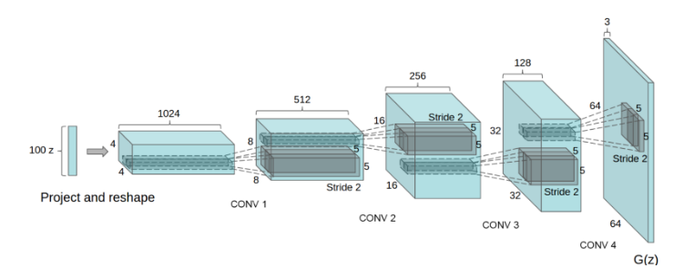

##### Deep Convolutional GANs (DCGANs)

## TL;DR: DCGANs were the first major improvement on the GAN architecture. They are more stable in terms of training and generate higher quality samples.

[Article]

DCGAN is one of the popular and successful network design for GAN. It mainly composes of convolution layers without max pooling or fully connected layers. It uses convolutional stride and transposed convolution for the downsampling and the upsampling. The figure below is the network design for the generator.

## Here is the summary of DCGAN:
 
  * [DCGAN Theory](#implementations)
    + [Replace all max pooling with convolutional stride]
    + [Use transposed convolution for upsampling]
    + [Eliminate fully connected layers.]
    + [Use Batch normalization except the output layer for the generator and the input layer of the discriminator.]
    + [Use ReLU in the generator except for the output which uses tanh]
    + [Use LeakyReLU in the discriminator.]
    
## DCGANs are also relevant because they have become one of the main baselines to implement and use GANs.
All models were trained with mini-batch stochastic gradient descent (SGD) with a mini-batch size of 128. All weights were initialized from a zero-centered Normal distribution with standard deviation 0.02. In the LeakyReLU, the slope of the leak was set to 0.2 in all models. While previous GAN work has used momentum to accelerate training, we used the Adam optimizer with tuned hyperparameters. We found the suggested learning rate of 0.001, to be too high, using 0.0002 instead. Additionally, we found leaving the momentum term β1 at the suggested value of 0.9 resulted in training oscillation and instability while reducing it to 0.5 helped stabilize training.

##
The simplicity of DCGAN contributes to its success. We reach certain bottleneck that increasing the complexity of the generator does not necessarily improve the image quality. Until we identify the bottleneck and know how to train GANs more effective, DCGAN remains a good start point for a new project.

    

