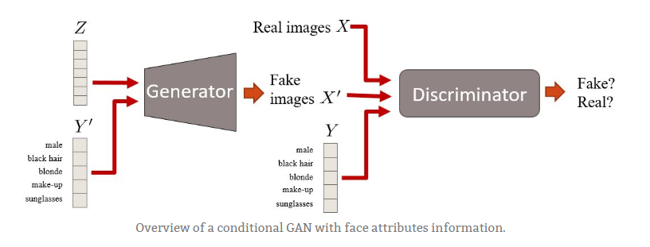

##### Deep Convolutional GANs (DCGANs)

## TL;DR: DCGANs were the first major improvement on the GAN architecture. They are more stable in terms of training and generate higher quality samples.

[Article]

The authors of the DCGAN focused on improving the architecture of the original vanilla GAN. 
I presume they had to spend quite a long time doing the most exciting thing about deep learning: 
try a lot of parameters! Yay! At the end, it totally paid off. Among other things, they found out that:

## Table of Contents
 
  * [DCGAN Theory](#implementations)
    + [Batch normalization is a must in both networks.]
    + [Fully hidden connected layers are not a good idea.]
    + [Avoid pooling, simply stride your convolutions!]
    + [Avoid pooling, simply stride your convolutions!]
    + [ReLU activations are your friend (almost always)]
    
## DCGANs are also relevant because they have become one of the main baselines to implement and use GANs.
Shortly after the publication of this paper, there were different accessible implementations in Theano, Torch, Tensorflow and Chainer available to test with whatever dataset you can think of. 
So, if you come across strange generated datasets you can totally blame these guys.

    

